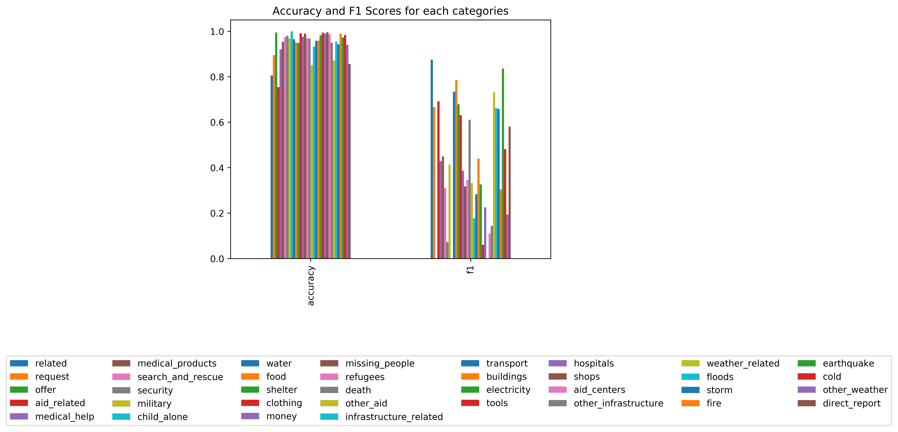
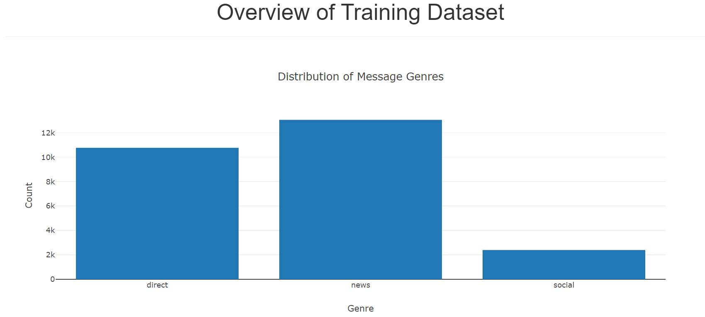
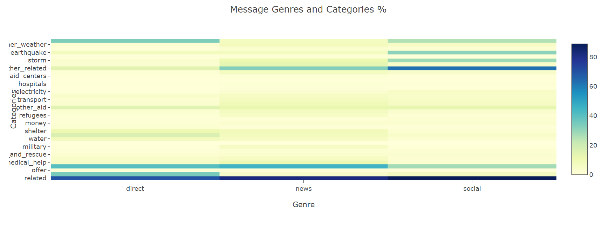

# Disaster Response Pipeline Project
This project is part of the [Udacity Datascience Nanodegree](https://www.udacity.com/course/data-scientist-nanodegree--nd025)

### Table of Contents

1. [Installation and Instructions](#installation)
2. [Project Motivation](#motivation)
3. [File Descriptions](#files)
4. [Licensing, Authors, and Acknowledgements](#licensing)
5. [Screenshots](#screenshots)

## Installation and Instructions 

The following Python packages are required: pandas, numpy, re, pickle, nltk, flask, json, plotly, sklearn, sqlalchemy and sys.

1. Run the following commands in the project's root directory to set up your database and model.

    - To run ETL pipeline that cleans data and stores in database
        `python data/process_data.py data/disaster_messages.csv data/disaster_categories.csv data/[database_name].db`
    - To run ML pipeline that trains classifier and saves
        `python models/train_classifier.py data/[database_name].db models/[model_name].pkl`

2. Run the following command in the app's directory to run your web app.
    `python run.py`

3. Go to http://localhost:3001/

## Project Motivation

Following a natural disaster, a very large number of messages are sent through various media in a very short term.
For response agencies on the ground, it is crucial to be able to quickly determine if these messages are related to the disaster and if yes, what type of help is needed: water, food, transportation...etc

This project takes real disaster following messages which are labelled and trains a model to classify them.
The model is then deployed on a web app in which users can input a message which will be classified by the model.

## File Descriptions 

1. In the folder data:

    - 2 csv files which are the dataset
    - 1 python script-process_data.py. Runs the ETL pipeline that cleans data and stores in a database
    - 1 database: the database produced by the process_data script

2. In the folder models:

    - 1 python script-train_classifier.py. Runs the ML pipeline and saves the model as a pickle file. Also output a png image showing the performance of the classifier on the test dataset for each category (accuracy and f1 scores)
    - 1 png image. As described above

3. In the folder app:

    - 1 folder-templates. Contains the html templates for the web app
    - 1 python script-run.py. Runs the web app

## Acknowledgements

Must give credit to Udacity and their partner Figure Eight for this very interesting Project

## Screenshots

Overview of the dataset

